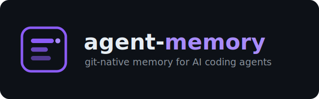

# agent-memory

<p align="center">
  
</p>

[](LICENSE)
[](https://github.com/xChuCx/agent-memory/actions/workflows/ci.yml)
[](go.mod)
[](#mcp-tools)
[](docs/eval/retrieval.md)
[](#agent-runtime-adapters)
[](#agent-runtime-adapters)
[](#agent-runtime-adapters)
[](#agent-runtime-adapters)

Local, **git-native** project memory for AI coding agents. One MCP call in,
structured memory updates out — current task state, decisions, conventions,
pitfalls, per-module facts. Branch-aware. Secret-safe. Byte-preserving.
**No cloud, no vector DB** — Markdown is the source of truth and git is the
sync. Three MCP tools + a full CLI.

Why it's different: memory is **plain Markdown committed to your repo**, so
you can read and `git diff` it; durable changes **stage for human review**
(`review --diff` → `apply`) instead of landing silently; and secrets/PII are
**scanned out** before anything is written. See [ROADMAP.md](ROADMAP.md) for
where this is headed (system-level / multi-repo memory).

## Demo

<p align="center">
  
</p>

An agent records a durable decision; it **stages** for review; you see the
exact **diff**, **apply** it, and a later **`fetch`** surfaces it — local,
git-native, reviewable, secret-safe. The clip is reproducible:
[`docs/demo/demo.sh`](docs/demo/demo.sh) is the runnable flow and
[`docs/demo/demo.tape`](docs/demo/demo.tape) renders the gif with
[`vhs`](https://github.com/charmbracelet/vhs) — see [docs/demo/](docs/demo/).

## How it compares

| Capability | AGENTS.md / CLAUDE.md | Vendor memory (e.g. Claude) | Vector / DB memory (mem0, Zep) | **agent-memory** |
|---|---|---|---|---|
| Plain-text, git-versioned source of truth | ✓ flat file | ✗ vendor-managed | ✗ DB / cloud | **✓ Markdown in your repo** |
| Structured, section-level updates | ✗ | ✗ | ~ | **✓** |
| Human review gate (see the diff first) | ✗ free edit | ✗ | ✗ | **✓ stage → `review --diff` → apply** |
| Vendor-neutral (MCP — any agent) | ~ broad convention | ✗ one vendor | ~ varies | **✓ Claude · Cursor · Codex · Gemini** |
| Secret / PII scan on write | ✗ | ✗ | ~ varies | **✓** |
| Team merge for concurrent edits | ✗ text conflicts | ✗ | ✗ | **✓ section merge driver** |
| Runs fully local (no cloud) | ✓ | ✗ | ~ varies | **✓** |

These are general characterizations and the tools evolve fast — see something
inaccurate? [Open an issue](https://github.com/xChuCx/agent-memory/issues) and
I'll fix the row. agent-memory is complementary to instruction files like
`AGENTS.md`/`CLAUDE.md` (it even installs one): those say *how to behave*;
agent-memory is the *durable, searchable, reviewed knowledge* behind it.

## Status

**Release 0.4** — the team-and-launch release: open-source-ready, safe to
share across a team (section-aware git merge driver), with a measured
retrieval-quality number. It builds on 0.3, the completeness-and-polish
release that closed the remaining design-doc gaps — much of it surfaced by
dogfooding agent-memory on its own repo:

- **Full MCP surface** — `memory.status` joins `fetch_context` and
  `propose_update` as the third tool.
- **M4 archival ops** — `archive_section` / `remove_section` /
  `rename_heading`, plus a server-maintained `index.md`.
- **Security layer** — secret + PII scanning with allowlist size limits;
  real per-section schema validation.
- **Observability** — structured `slog` logging (stderr-only, secret-safe).
- **Smarter retrieval** — Jaccard dedup, the §20.4 ranking signals,
  OR-match recall, crash-safe FTS queries.
- **Fuller CLI** — `propose` (write without an MCP server), `review --diff`,
  staging-id prefixes + `--latest`.

The Core Contract from v0.1.0 (Design Doc v0.4.1: MCP server, structured
operations, drift-checked staging, secret scanning, Claude Code adapter)
is unchanged — every release since has been additive.

**0.4 adds:** the section-aware git **merge driver** (team-shared memory
unions instead of conflicting), an offline **retrieval-quality eval**
(recall@5 0.98, CI-guarded), Apache-2.0 licensing + open-source packaging,
and a corrected Go module path so `go install …@latest` works. The
behavioural eval harness remains the main deferred item — see
[ROADMAP.md](ROADMAP.md).

See [CHANGELOG.md](CHANGELOG.md) for the full changelist.

| Document | Purpose |
|---|---|
| [ROADMAP.md](ROADMAP.md) | Where the project is going, principles, and non-goals. |
| [CHANGELOG.md](CHANGELOG.md) | Per-release feature list and known limitations. |
| [Design Doc v0.4.1](agent-memory-design-doc-v0.4.1.md) | Canonical design this binary implements. |
| [Implementation Plan](agent-memory-implementation-plan.md) | Historical MVP build log (M0–M8); see ROADMAP for what's next. |
| [Retrieval eval](docs/eval/retrieval.md) | Offline recall/MRR/nDCG benchmark of `fetch` (method + numbers). |
| [Patterns](docs/patterns/) | Reusable design patterns documented per subsystem. |
| [Spikes](docs/spikes/) | Pre-M1 spike outcomes (byte-preserving engine, MCP SDK, flock, FTS5). |

## Quick start

**Install — download a prebuilt binary** (recommended): grab the archive
for your OS/arch from the [latest release](https://github.com/xChuCx/agent-memory/releases/latest),
extract it, and put `agent-memory` on your `PATH`. No toolchain needed.

```bash
# Go toolchain alternative (Go 1.25+)
go install github.com/xChuCx/agent-memory/cmd/agent-memory@latest

# from source
go build -o agent-memory ./cmd/agent-memory
```

Homebrew, Scoop, and winget packages are planned.

Then, inside the repo you want to give a memory:

```bash
# Scaffold .agent-memory/ in a repo
agent-memory init --name my-project

# Install the Claude Code skill (writes .claude/skills/agent-memory/SKILL.md)
agent-memory install claude

# Verify (prints the release tag, the go-install version, or dev+vcs locally)
agent-memory version

# Read context
agent-memory fetch                # bootstrap pack
agent-memory fetch "auth"         # FTS query

# Start MCP server (your agent spawns this automatically once configured)
agent-memory mcp
```

Register the MCP server with your agent. For Claude Code, either run
`claude mcp add agent-memory -- agent-memory mcp --root /abs/path/to/repo`,
or commit a project-scoped `.mcp.json` at the repo root:

```json
{
  "mcpServers": {
    "agent-memory": {
      "command": "agent-memory",
      "args": ["mcp", "--root", "/abs/path/to/repo"]
    }
  }
}
```

Pinning `--root` makes the server independent of the launch directory. Other
runtimes (Cursor, Gemini CLI, anything reading `AGENTS.md`) use the same
server — install their adapter (see below) and point them at `agent-memory mcp`.

## Adopt on an existing project

`init` scaffolds empty memory. To seed it from a real codebase, let your
coding agent do the analysis — that's the whole point. After `init` +
`install <adapter>` + registering the MCP server (above), **restart the
agent** so the `memory.*` tools load, then paste the prompt below.

What happens: the agent reads the repo and calls `memory.propose_update`.
Working notes and pitfalls apply immediately; durable categories
(conventions, decisions, modules) **stage for your review** — inspect each
with `agent-memory review --diff` and land it with `agent-memory apply`
(or `reject`). Nothing durable is written without your approval.

````text
You now have agent-memory MCP tools (memory.fetch_context,
memory.propose_update, memory.status) backed by this repository's
.agent-memory/ store. Bootstrap the project's memory from the codebase.

1. Call memory.fetch_context with an empty query to see the current
   (mostly empty) state and the conventions/decisions/pitfalls/modules
   layout.

2. Analyze THIS repository — read the build files, CI config, entry
   points, and the main packages/modules. Identify:
   - build / test / run / lint commands and the toolchain;
   - conventions: code style, branching, commit rules, review practices;
   - architecture: the major modules/components and what each is for;
   - durable decisions: notable choices and WHY (only ones that are real
     and stable — not speculation);
   - pitfalls: footguns, sharp edges, "don't do X because Y" you can infer
     from the code, tests, or docs.

3. Persist what you found via memory.propose_update, choosing the intent
   per kind:
   - update_conventions  → conventions.md (build/test/style/workflow)
   - refresh_module      → modules/<name>.md (one per major component)
   - record_decision     → decisions.md (Date / Status / Confidence +
                           sources; type ∈ file|test|user, NOT external)
   - add_pitfall         → pitfalls.md
   - update_shared       → local/current.shared.md (a short "current
                           state / where things stand" summary)

Rules:
- Cite provenance: pass sources as file references you actually read
  (e.g. {"type":"file","ref":"internal/auth/session.go"}). Use
  confidence=confirmed for facts from code, inferred for deductions.
- Every section needs a unique "<!-- @id: ... -->" anchor; keep entries
  concise — this is working knowledge, not a wiki. Decisions need
  **Date**, **Status** (active|superseded|deprecated|proposed), and
  **Confidence** fields.
- NEVER put secrets, tokens, or credentials in memory (the server will
  reject them anyway).
- Work in a few focused passes (conventions + architecture first, then
  modules, then decisions/pitfalls). Report what you proposed and what
  staged for review.
````

No MCP server handy? The agent (or you) can use the CLI instead — same
validation/secret-scan/routing pipeline:

```bash
agent-memory propose --intent update_conventions --op append_section \
  --path conventions.md --heading "Build & test" --heading-level 2 \
  --source file:Makefile --confidence confirmed \
  --content-file - <<'MD'
## Build & test
<!-- @id: build-test -->
Run `go build ./...` and `go test ./...`. ...
MD
# add --apply to land it immediately (you are the reviewer);
# or omit it and review the staged proposal with `review --diff` + `apply`.
```

## Build

Requires Go 1.25+ (the MCP SDK transitively requires it).

```bash
go build -o agent-memory ./cmd/agent-memory   # binary
go test ./...                                  # unit + integration tests
go test -tags=e2e ./internal/e2e/...           # end-to-end smoke (linux/macos)
go test -race ./internal/...                   # race detector
```

`make` targets are equivalent to the `go` commands above; see the
`Makefile` if you prefer that style.

## CLI

```bash
agent-memory init [--root DIR] [--name NAME] [--force]
        # Create the .agent-memory/ scaffold.

agent-memory status [--root DIR] [--json]
        # Project state: version, file counts per category, lock metadata.

agent-memory doctor [--root DIR]
        # Diagnostic layout checks. Advisory; exits 0 even with findings.

agent-memory fetch [QUERY] [--scope X,Y] [--budget N]
                   [--exclude-archive] [--json] [--root DIR]
        # Return a budgeted Markdown context pack.

agent-memory mcp [--root DIR]
        # Start the MCP server (stdio). Exposes memory.fetch_context and
        # memory.propose_update.

agent-memory propose --intent INTENT --op OP --path PATH [op flags...]
                     [--content STR | --content-file FILE|-] [--source type:ref]
                     [--confidence C] [--apply] [--from-json FILE|-] [--json]
        # Create a proposal WITHOUT an MCP server, through the same
        # validate / secret-scan / route pipeline. --from-json takes a full
        # multi-op ProposeRequest; --apply immediately lands a result that
        # would otherwise stage (you are the reviewer).

agent-memory review [STAGING_ID] [--diff] [--show] [--json] [--root DIR]
        # List staged proposals or inspect one. --diff shows a unified diff
        # of each staged file vs the current on-disk version.

agent-memory apply STAGING_ID [--json] [--root DIR]
        # Re-validate drift and apply a staged proposal.

agent-memory reject STAGING_ID [--json] [--root DIR]
        # Discard a staged proposal.

agent-memory rebase STAGING_ID [--force] [--json] [--root DIR]
        # Re-plan a staged proposal against the current disk state
        # after target_drift. --force is required for soft drifts
        # (acknowledges accepting the new base as planning input).

# review / apply / reject / rebase accept a full STAGING_ID, any unique
# prefix (Git-style), or --latest for the most recently staged proposal:
#   agent-memory apply 20260527       # unique prefix
#   agent-memory apply --latest       # newest staged proposal

agent-memory install <adapter> [--user-global] [--force] [--json]
        # Materialise agent-runtime adapter assets.
        # Supported: claude, cursor, agents, gemini.

agent-memory merge-driver --install [--root DIR]
        # Register the section-aware git merge driver so a team's concurrent
        # edits to .agent-memory/ files union by @id instead of conflicting.
        # Run once per clone. (git invokes the bare `merge-driver %O %A %B %P`
        # form itself during a merge.)

agent-memory rebuild-index [--root DIR] [--clobber] [--no-assign-ids] [--json]
        # Recreate the FTS5 shadow index from canonical Markdown files.
        # Use for SQLite corruption, schema changes, or after manual .md edits.

agent-memory sweep [--root DIR] [--ttl DURATION] [--dry-run] [--json]
        # Remove staged proposals past the manifest's staging.ttl_seconds.
        # Each removal also writes a ttl_expired entry to meta/rejection-log.jsonl.

agent-memory version
        # Print binary version and exit.
```

## MCP tools

Exposed by `agent-memory mcp` over stdio JSON-RPC:

| Tool | Purpose |
|------|---------|
| `memory.fetch_context` | Read a budgeted Markdown context pack. |
| `memory.propose_update` | Submit structured edits (apply or stage). |
| `memory.status` | Report memory health: file counts, staged proposals (with drift), security/git/lock posture. |

## Evidence (measured)

Three layers, honest about scope — **retrieval → continuity → behaviour**.
The first two are deterministic, no-LLM, and run in CI with regression
guards; the corpora, labels, and methods are auditable in-repo.

**1 · Retrieval quality.** Does `fetch` return the *right* sections? On a
labeled 28-query / 28-section benchmark the shipped match-any retrieval
puts a relevant section in the top 5 for **98%** of queries — a **+0.91
recall lift** over the prior match-all behaviour.

| Config | recall@5 | hit@1 | MRR |
|---|---|---|---|
| match-all (AND) — prior | 0.07 | 0.07 | 0.07 |
| **match-any (OR) — shipped** | **0.98** | **0.96** | **0.97** |

→ method + caveats: [docs/eval/retrieval.md](docs/eval/retrieval.md) · `go test -run TestRetrievalEval -v ./internal/eval/`

**2 · Cross-session continuity.** Does a lesson recorded in one session
survive into the next? Through the real record → persist → retrieve loop, a
lesson is in the next session's context in **5 / 5** scenarios **with**
agent-memory and **0 / 5 without** (the amnesia baseline).

→ [docs/eval/continuity.md](docs/eval/continuity.md) · `go test -run TestMemoryContinuity -v ./internal/eval/`

**3 · Behavioural (task-success).** Does the agent *act* on it — fewer
repeated mistakes? That needs an LLM in the loop, so it ships as a runnable
A/B harness ("groundhog-day", with vs without memory) you run with your own
model: [eval/behavioural/](eval/behavioural/). (Not in CI by design.)

## Agent-runtime adapters

`agent-memory install <adapter>` drops a worked instruction file at the
location each runtime reads from:

| Adapter | Target file | Notes |
|---------|------------|-------|
| `claude` | `.claude/skills/agent-memory/SKILL.md` | Claude Code skill format. `--user-global` writes to `~/.claude/skills/`. |
| `cursor` | `.cursor/rules/agent-memory.mdc` | Cursor MDC rule with description-based matching. `--user-global` writes to `~/.cursor/rules/`. |
| `agents` | `AGENTS.md` (repo root) | Industry-broad convention. Read by OpenAI Codex CLI, Cursor's agent mode, Sourcegraph Cody, etc. Project-local only. |
| `gemini` | `GEMINI.md` (repo root) | Gemini CLI long-term project context. Project-local only. |

Each file teaches the runtime when to call `memory.fetch_context` and
`memory.propose_update`, the intent vocabulary, provenance rules, and
debugging reject reasons. The same behavioural model across all four;
each adapter just wraps it in the runtime's native format.

## Architecture (at a glance)

```
.agent-memory/
├── meta/
│   ├── manifest.yaml      operational settings (budgets, approval, security)
│   ├── schema.yaml        per-category file/glob, section schema, provenance
│   ├── index.sqlite       FTS5 shadow index (regenerable)
│   ├── lock               OS-level advisory lock (flock)
│   └── lock.info          informational metadata sidecar
├── conventions.md         project conventions
├── decisions.md           durable architectural decisions
├── pitfalls.md            known footguns
├── index.md               server-managed memory index summary
├── modules/<name>.md      per-module facts
├── archive/<date>-*.md    write-once archived entries
├── local/
│   ├── current.shared.md  cross-branch working notes
│   └── current.<branch>.md branch-scoped working notes
├── sessions/<YYYY-MM-DD>.md per-day session logs
└── staging/<id>/          pending human-review proposals
    ├── proposal.json
    ├── target-checksums.json
    └── files/<rel-path>
```

## Layout

```
cmd/agent-memory/                       CLI entry point
internal/
  adapters/claude/                      embedded SKILL.md + Install()
  cli/                                  cobra subcommands
  config/ schema/                       YAML loaders (manifest + schema)
  e2e/                                  release-0.1 smoke test (-tags=e2e)
  fs/                                   atomic writes, path validation
  git/                                  branch resolver
  index/                                FTS5 incremental index
  lock/                                 flock-based advisory lock
  markdown/                             byte-preserving Markdown engine
  mcp/                                  stdio MCP server
  memory/                               operations, security, orchestrator, staging
spikes/                                 pre-M1 spike investigations (S1-S4)
docs/
  patterns/                             design patterns
  spikes/                               spike outcome docs
.github/workflows/ci.yml                CI: tests + e2e + lint
agent-memory-design-doc-v0.4.1.md       canonical design
agent-memory-implementation-plan.md     build plan
CHANGELOG.md                            per-release feature list
```

## Releases

Tag-driven via [goreleaser](https://goreleaser.com/). Pushing a `v*`
tag triggers
[`.github/workflows/release.yml`](.github/workflows/release.yml),
which builds the binary matrix and publishes a GitHub Release with
archives attached.

Matrix per release:

- `linux_amd64`, `linux_arm64`
- `darwin_amd64`, `darwin_arm64`
- `windows_amd64`, `windows_arm64`

Each archive contains the `agent-memory` binary, `README.md`, and
`CHANGELOG.md`. A sibling `agent-memory_<version>_checksums.txt`
provides SHA-256 hashes.

```bash
# Verify a downloaded archive
sha256sum -c agent-memory_0.2.0_checksums.txt
```

Local dry-run of the release pipeline (requires `goreleaser`
installed):

```bash
goreleaser check                       # parse + validate .goreleaser.yml
goreleaser release --snapshot --clean  # full build with no upload
```

Source builds always identify as `dev`:

```
$ go build -o agent-memory ./cmd/agent-memory
$ ./agent-memory version
dev
```

Release builds via goreleaser stamp the actual tag through
`-ldflags='-X .../cli.ProgramVersion=v0.X.Y'`.

## License

[Apache License 2.0](LICENSE). You may use, modify, and distribute this
software under its terms; it includes an express patent grant. Contributions
are accepted under the same license (see [CONTRIBUTING.md](CONTRIBUTING.md)).
