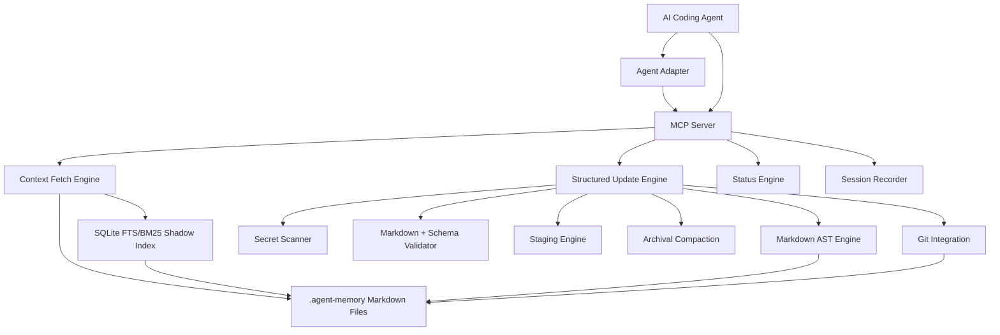

# Agent Memory Protocol — Design Doc v0.3

**Status:** Draft v0.3  
**Primary implementation language:** Go  
**MCP SDK:** `github.com/modelcontextprotocol/go-sdk`  
**Storage model:** Markdown source of truth + rebuildable SQLite FTS/BM25 shadow index  
**Target users:** developers and AI coding agents working with large or long-lived codebases  
**Working name:** `agent-memory`

---

## 0. v0.3 Change Summary

This revision incorporates the major architectural corrections from v0.2 feedback.

### Accepted v0.3 Changes

1. **Remove unified diff from the agent-facing API**  
   Agents should not generate line-based patches. They should submit structured Markdown operations such as `replace_section`, `append_section`, and `create_file`.

2. **Move dry-run/apply out of the agent-facing workflow**  
   The agent should not review its own diff. Human approval is controlled by project policy. The server either applies immediately or stages changes for later human review.

3. **Separate durable shared memory from local ephemeral memory**  
   `current.md`, `sessions/`, `staging/`, and local indexes are ignored by Git by default.

4. **Use Markdown AST operations for safe updates**  
   The server parses Markdown, finds headings, replaces sections safely, validates output, scans secrets, writes atomically, and rebuilds the index.

5. **Make staging a first-class workflow**  
   If human approval is required, proposed updates are saved to `.agent-memory/staging/`. Developers approve them through CLI commands.

6. **Fix Go SDK position**  
   The design uses the official Go MCP SDK rather than a community SDK or handwritten JSON-RPC.

---

## 1. Summary

`agent-memory` is a local context middleware for AI coding agents.

It gives agents a compact, safe, searchable, version-controlled memory layer for a repository. Instead of forcing agents to repeatedly rediscover project structure, conventions, architectural decisions, pitfalls, and current task state, `agent-memory` maintains a structured `.agent-memory/` directory and exposes it through a minimal MCP interface.

The product is not “a bunch of Markdown files”. The product is a **local context router and memory safety layer**:

```text
agent asks for context
        ↓
server searches, ranks, validates, budgets
        ↓
agent receives a compact context pack
        ↓
agent proposes structured memory operations
        ↓
server validates, scans, stages or applies
        ↓
memory remains small, safe, searchable, and reviewable
```

The source of truth is Markdown.  
The interface is MCP.  
The implementation is Go.  
The index is SQLite and fully rebuildable.

---

## 2. Problem

AI coding agents degrade on large or long-lived projects because they lack durable, trustworthy, budgeted project memory.

Common failure modes:

1. **Repeated rediscovery**  
   Agents repeatedly inspect the same files to understand conventions, architecture, test commands, module boundaries, and prior decisions.

2. **Context-window pressure**  
   Large repositories cannot fit into model context. Agents need a compact map, not raw repository contents.

3. **Stale or bloated memory**  
   Naive memory-bank approaches create large Markdown files that agents append to forever.

4. **Unsafe writes**  
   Agents may persist secrets, credentials, customer data, incorrect assumptions, or prompt-injection content.

5. **Tool overload**  
   Too many small MCP tools make agents waste turns, call tools in the wrong order, or loop.

6. **Bad patch generation**  
   Agents are unreliable at generating unified diffs for natural-language Markdown. Line-based patches often fail due to missing context, whitespace errors, or invalid hunks.

7. **False review loops**  
   Asking an agent to generate a diff, review its own diff, and then apply it creates a fake safety boundary.

8. **Git conflicts in local state**  
   Files such as `current.md` and session logs create constant conflicts when committed by multiple developers.

9. **Poor cross-agent portability**  
   Claude Code, Codex, Cursor, Cline, Windsurf, Copilot, and other agents all use different instruction and memory mechanisms.

---

## 3. Goals

### 3.1 Product Goals

- Provide a compact, safe, searchable project memory layer.
- Work across multiple coding agents.
- Keep the public MCP tool surface tiny.
- Keep Markdown as the human-readable source of truth.
- Support one-command initialization inside any Git repository.
- Make durable memory updates reviewable by humans.
- Prevent memory bloat through archival compaction.
- Reject secrets before they are written.
- Avoid giving agents fragile patch-based interfaces.
- Keep local agent state out of shared Git history by default.

### 3.2 Engineering Goals

- Ship as a single Go binary.
- Use the official Go MCP SDK.
- Avoid runtime dependency on Node, Python, Docker, or external services.
- Use SQLite FTS5/BM25 for MVP search.
- Use Markdown AST operations for updates.
- Avoid vector search in v0 unless proven necessary.
- Support `stdio` MCP transport for local agent usage.
- Keep adapters separate from core memory logic.
- Preserve a clean boundary so indexing can be replaced later.

---

## 4. Non-Goals

For MVP, this project will not:

- Build a full vector database.
- Store entire conversations as durable memory.
- Replace code search or IDE semantic tooling.
- Replace `AGENTS.md`, `CLAUDE.md`, or Cursor rules.
- Automatically trust generated memory updates.
- Use destructive compaction.
- Require a remote service.
- Require cloud sync.
- Try to be a personal knowledge management system.
- Solve general long-term LLM memory outside a repository.
- Ask agents to generate or apply unified diffs.
- Ask agents to approve their own changes.

---

## 5. Core Principles

1. **One fetch, not many reads**  
   Agents should call one tool to get relevant context.

2. **Markdown is the source of truth**  
   Memory must be readable and editable by humans.

3. **SQLite is a shadow index**  
   The index is derived, local, ignored by Git, and always rebuildable.

4. **MCP is an interface, not the storage format**  
   The memory format should survive client churn.

5. **Agent-facing operations must be semantic, not line-based**  
   Agents propose section-level updates. The server handles Markdown AST manipulation.

6. **Compaction archives; it does not destroy**  
   Stale implementation details move to archive, not oblivion.

7. **Human approval is policy-controlled**  
   If approval is required, changes are staged. The agent does not review its own diff.

8. **Every durable fact needs provenance**  
   Memory should record whether a fact came from code, tests, user instruction, or inference.

9. **Secrets are rejected before write**  
   Security checks happen before persistence.

10. **Tool surface must stay tiny**  
    Public MCP tools should remain below five.

11. **Local state must not pollute shared Git history**  
    Current task state, session logs, staging, locks, and indexes are ignored by default.

12. **Context is budgeted, ranked, and freshness-aware**  
    Agents receive the best context pack, not every possibly relevant file.

---

## 6. Target Users

### 6.1 Primary Users

- Developers using coding agents on non-trivial repositories.
- AI engineering teams building workflows around Claude Code, Codex, Cursor, or similar tools.
- Teams with large monorepos or long-running feature branches.

### 6.2 Secondary Users

- Open-source maintainers who want agent-friendly repositories.
- Internal platform teams standardizing agent workflows.
- Agent framework authors looking for a portable project-memory layer.

---

## 7. High-Level Architecture



### 7.1 Main Components

| Component | Responsibility |
|---|---|
| CLI | User-facing commands: init, fetch, status, review, apply, install adapters |
| MCP Server | Exposes a tiny tool surface to agents |
| Fetch Engine | Builds ranked context packs |
| Index Engine | Builds and queries SQLite FTS/BM25 shadow index |
| Markdown AST Engine | Applies structured section-level operations safely |
| Update Engine | Accepts proposed structured memory changes and validates them |
| Security Engine | Rejects secrets and unsafe content |
| Staging Engine | Stores human-review-required updates |
| Archiver | Moves stale details into archive files |
| Adapter Generator | Creates files for Claude, Codex, Cursor, etc. |
| Git Integration | Produces diffs and optional commits for approved durable memory |

---

## 8. Memory Classes

`agent-memory` separates repository memory into three classes.

### 8.1 Durable Shared Memory

Committed to Git by default.

Purpose:

- Low-churn, team-relevant, reviewable memory.
- Durable project facts.
- Architecture and conventions.
- Known pitfalls.
- Module-level knowledge.
- Historical archive.

Examples:

```text
.agent-memory/index.md
.agent-memory/conventions.md
.agent-memory/decisions.md
.agent-memory/pitfalls.md
.agent-memory/modules/
.agent-memory/archive/
.agent-memory/meta/manifest.json
.agent-memory/meta/schema.json
```

### 8.2 Local Ephemeral Memory

Ignored by Git by default.

Purpose:

- Local agent state.
- Current task state.
- Session notes.
- Human approval staging.
- Developer-specific or branch-specific context.

Examples:

```text
.agent-memory/current.md
.agent-memory/sessions/
.agent-memory/staging/
```

### 8.3 Derived Memory

Ignored by Git by default.

Purpose:

- Rebuildable indexes.
- Locks.
- Caches.
- Local metadata.

Examples:

```text
.agent-memory/meta/index.sqlite
.agent-memory/meta/*.db
.agent-memory/meta/lock.json
```

---

## 9. Repository Memory Layout

```text
.agent-memory/
  index.md
  conventions.md
  decisions.md
  pitfalls.md

  modules/
    auth.md
    payments.md
    frontend.md

  archive/
    2026-05-auth-cookie-v1.md

  current.md

  sessions/
    2026-05-26.md

  staging/
    2026-05-26T121500-auth-token-rotation/
      proposal.json
      preview.diff
      files/

  meta/
    manifest.json
    schema.json
    lock.json
    index.sqlite
```

### 9.1 Required `.agent-memory/.gitignore`

`agent-memory init` must create `.agent-memory/.gitignore`:

```gitignore
# Local state
current.md
sessions/
staging/

# Local indexes, caches, and locks
meta/*.sqlite
meta/*.sqlite-*
meta/*.db
meta/*.db-*
meta/lock.json
```

### 9.2 Git-Tracked by Default

```text
index.md
conventions.md
decisions.md
pitfalls.md
modules/
archive/
meta/manifest.json
meta/schema.json
.gitignore
```

### 9.3 Ignored by Default

```text
current.md
sessions/
staging/
meta/index.sqlite
meta/*.db
meta/lock.json
```

### 9.4 Optional Tracking

A team may choose to track `current.md` or `sessions/`, but this is not recommended for multi-developer repositories.

Configuration:

```json
{
  "git": {
    "track_current": false,
    "track_sessions": false
  }
}
```

Default:

```json
{
  "git": {
    "track_current": false,
    "track_sessions": false
  }
}
```

---

## 10. Memory Files

### 10.1 `index.md`

A small routing file. It should not contain full project knowledge.

Purpose:

- List important memory files.
- Explain when to use each file.
- Track freshness.
- Track stale areas.
- Keep the memory graph navigable.

Example:

```md
# Agent Memory Index

## Always include
- current.md — current local task state and open questions
- conventions.md — build, test, style, and workflow rules

## Topic map
- decisions.md — durable architecture/product decisions
- pitfalls.md — known traps and recurring failures
- modules/auth.md — authentication notes
- modules/payments.md — payments module notes

## Freshness
Last compacted: 2026-05-26
Known stale areas:
- modules/frontend.md
```

### 10.2 `current.md`

Local ephemeral state.

Should include:

- Current active task.
- Last known implementation state.
- Next steps.
- Blockers.
- Open questions.
- Recently modified areas.

This file is ignored by Git by default.

### 10.3 `conventions.md`

Durable working rules.

Examples:

- Test commands.
- Formatting commands.
- Branching conventions.
- Migration rules.
- Naming conventions.
- Required review practices.

### 10.4 `decisions.md`

ADR-like durable decisions.

Each decision should include:

```md
## Decision: Use refresh-token rotation

Date: 2026-05-26
Status: active
Confidence: confirmed by tests

Context:
...

Decision:
...

Consequences:
...

Sources:
- file: internal/auth/refresh.go
- test: internal/auth/refresh_test.go
```

### 10.5 `pitfalls.md`

Known traps.

Each entry should explain:

- What failed.
- Why it failed.
- How to avoid repeating it.
- Related files/tests.
- Freshness/confidence.

### 10.6 `modules/*.md`

Module-specific memory.

Examples:

- `modules/auth.md`
- `modules/billing.md`
- `modules/search.md`
- `modules/frontend-routing.md`

These files should hold durable module-level context, not raw code summaries.

### 10.7 `archive/*.md`

Archived historical context.

Archive files are not loaded by default. They are fetched only when search strongly matches or the query explicitly asks for history.

Compaction should move stale details here instead of deleting them.

### 10.8 `sessions/*.md`

Local session summaries.

These are ignored by Git by default.

They are not primary context. They are raw material for future curated memory updates.

---

## 11. Public MCP Tool Surface

The MCP server exposes only four tools.

```text
memory.fetch_context
memory.propose_update
memory.record_session
memory.status
```

No public tools for:

```text
read_file
read_index
search
upsert_note
apply_patch
compact
delete_section
```

Those are internal server operations.

---

## 12. MCP Tool Contracts

## 12.1 `memory.fetch_context`

Fetches a compact, ranked, budgeted context pack.

### Input

```json
{
  "query": "auth refresh token migration",
  "scope": ["auth"],
  "budget": 6000,
  "include": ["current", "conventions", "decisions", "pitfalls", "modules"]
}
```

### Input Fields

| Field | Type | Required | Description |
|---|---:|---:|---|
| `query` | string | no | Search query. If empty, returns bootstrap context. |
| `scope` | string[] | no | Optional paths or module names to prioritize. |
| `budget` | number | no | Approximate output budget in chars or tokens. |
| `include` | string[] | no | Context categories to include. |

### Output

```json
{
  "context": "...markdown context pack...",
  "included_files": [
    {
      "path": ".agent-memory/current.md",
      "reason": "always included for active local state",
      "freshness": "fresh",
      "confidence": "confirmed"
    }
  ],
  "omitted": [
    {
      "path": ".agent-memory/archive/2026-05-auth-cookie-v1.md",
      "reason": "archived and below relevance threshold"
    }
  ],
  "suggested_next_queries": [
    "auth token tests",
    "refresh service pitfalls"
  ]
}
```

### Behavior

If `query` is empty:

```text
return current.md + conventions.md + compact index.md summary
```

If `query` is present:

```text
1. Always include current.md if it exists.
2. Include conventions.md unless explicitly excluded.
3. Search memory files with SQLite FTS/BM25.
4. Boost scope matches.
5. Boost fresh and active files.
6. Penalize archive files unless strongly relevant.
7. Include decisions and pitfalls when relevant.
8. Enforce budget.
9. Return one context pack.
```

---

## 12.2 `memory.propose_update`

Accepts structured memory update operations.

This is the only agent-facing update tool.

The agent does not submit unified diffs.  
The agent does not choose `dry_run` or `apply`.  
The server decides whether to apply or stage based on project policy.

### Input

```json
{
  "intent": "refresh_module",
  "rationale": "Auth refresh flow changed after token rotation refactor.",
  "operations": [
    {
      "operation": "replace_section",
      "path": "modules/auth.md",
      "heading": "Token Rotation",
      "heading_level": 2,
      "content": "## Token Rotation\n\nRefresh tokens are rotated on every successful use.\n\nSources:\n- file: internal/auth/refresh.go\n- test: internal/auth/refresh_test.go\n"
    }
  ],
  "changed_files": [
    "internal/auth/refresh.go",
    "internal/auth/refresh_test.go"
  ],
  "sources": [
    {
      "type": "file",
      "ref": "internal/auth/refresh.go"
    },
    {
      "type": "test",
      "ref": "internal/auth/refresh_test.go"
    }
  ]
}
```

### Input Fields

| Field | Type | Required | Description |
|---|---:|---:|---|
| `intent` | enum | yes | Type of memory update. |
| `rationale` | string | yes | Why this memory update is needed. |
| `operations` | object[] | yes | Structured Markdown operations. |
| `changed_files` | string[] | no | Repository files related to the update. |
| `sources` | object[] | no | Provenance. |

### Supported Intents

```text
update_current
record_decision
add_pitfall
refresh_module
archive_stale
update_conventions
```

### Supported Operations

```text
create_file
append_section
replace_section
append_to_section
archive_section
```

No `delete_section` in MVP.

### Operation: `create_file`

Creates a new memory file.

```json
{
  "operation": "create_file",
  "path": "modules/search.md",
  "content": "# Search Module\n\n..."
}
```

Rules:

- Fails if file already exists unless `if_exists` is specified.
- Path must stay inside `.agent-memory/`.
- Path must not target ignored derived files.
- Durable files require provenance unless project policy disables it.

Optional:

```json
{
  "if_exists": "reject"
}
```

Allowed values:

```text
reject
append
replace
```

Default:

```text
reject
```

### Operation: `append_section`

Appends a new top-level or nested section.

```json
{
  "operation": "append_section",
  "path": "modules/auth.md",
  "parent_heading": "Auth Module",
  "heading": "Token Rotation",
  "heading_level": 2,
  "content": "## Token Rotation\n\n..."
}
```

Rules:

- If `parent_heading` is present, append inside that section.
- If absent, append to end of file.
- The heading in `content` must match `heading` and `heading_level`.
- Fails if the section already exists unless `if_exists` is specified.

### Operation: `replace_section`

Replaces a section identified by heading text and heading level.

```json
{
  "operation": "replace_section",
  "path": "modules/auth.md",
  "heading": "Token Rotation",
  "heading_level": 2,
  "content": "## Token Rotation\n\n..."
}
```

Rules:

- Server parses Markdown AST.
- Server finds the matching heading.
- Server replaces content until the next heading of the same or higher level.
- Fails if heading is not found unless `if_missing` is specified.
- Fails if multiple matching headings exist unless `occurrence` is specified.
- The heading in `content` must match `heading` and `heading_level`.

Optional:

```json
{
  "if_missing": "append",
  "occurrence": 1
}
```

Allowed `if_missing` values:

```text
reject
append
create_file
```

Default:

```text
reject
```

### Operation: `append_to_section`

Appends content inside an existing section.

```json
{
  "operation": "append_to_section",
  "path": "pitfalls.md",
  "heading": "Authentication",
  "heading_level": 2,
  "content": "- Old tests assumed refresh tokens remained stable.\n"
}
```

Rules:

- Does not replace existing content.
- Appends before the next heading of the same or higher level.
- Useful for pitfalls and short session-derived notes.
- Subject to duplicate detection.

### Operation: `archive_section`

Moves a section into archive and replaces it with a short pointer.

```json
{
  "operation": "archive_section",
  "path": "modules/auth.md",
  "heading": "Cookie Refresh Legacy Flow",
  "heading_level": 2,
  "archive_path": "archive/2026-05-auth-cookie-v1.md",
  "replacement": "## Cookie Refresh Legacy Flow\n\nArchived historical implementation details: `archive/2026-05-auth-cookie-v1.md`.\n"
}
```

Rules:

- Server moves the original section to `archive_path`.
- Server writes `replacement` into original file.
- Archive path must be inside `.agent-memory/archive/`.
- Archive operation never destroys content.
- Archive file is durable and committed by default.

### Server-Side Pipeline

```text
1. Parse input.
2. Validate intent.
3. Validate operation schema.
4. Normalize paths.
5. Reject paths outside .agent-memory.
6. Load target files.
7. Parse Markdown AST.
8. Apply structured operations in memory.
9. Validate resulting Markdown.
10. Run secret scan.
11. Run poisoning checks.
12. Check size budgets.
13. Check duplicate content.
14. Generate preview diff for humans/logs.
15. If approval is required, stage proposal.
16. If approval is not required, write atomically.
17. Rebuild SQLite shadow index.
18. Optionally git add/commit durable memory files.
```

### Output: Applied

```json
{
  "status": "applied",
  "changed_files": [
    ".agent-memory/modules/auth.md"
  ],
  "index_rebuilt": true,
  "warnings": []
}
```

### Output: Staged

```json
{
  "status": "staged",
  "staging_id": "2026-05-26T121500-auth-token-rotation",
  "human_approval_required": true,
  "message": "Memory update staged. Human approval required via `agent-memory review` and `agent-memory apply`."
}
```

### Output: Rejected

```json
{
  "status": "rejected",
  "reason": "secret_detected",
  "findings": [
    {
      "type": "github_token",
      "location": "operations[0].content line 8"
    }
  ],
  "required_action": "Rewrite the memory update without copying credentials or token-like values."
}
```

---

## 12.3 `memory.record_session`

Records a local session summary.

### Input

```json
{
  "summary": "Refactored auth refresh flow and added tests for token rotation.",
  "changed_files": [
    "internal/auth/refresh.go",
    "internal/auth/refresh_test.go"
  ],
  "decisions": [
    "Refresh tokens are now rotated on every use."
  ],
  "pitfalls": [
    "Old tests assumed stable refresh token values."
  ],
  "open_questions": [
    "Should old refresh tokens be stored for audit?"
  ]
}
```

### Behavior

- Writes to ignored local `sessions/`.
- Does not automatically update durable memory unless configured.
- May suggest follow-up `memory.propose_update`.
- Runs secret scan before writing.
- Does not require human approval because sessions are local by default.

---

## 12.4 `memory.status`

Returns memory health and metadata.

### Output

```json
{
  "memory_version": "0.3.0",
  "repo": "my-service",
  "durable_notes_count": 18,
  "archive_count": 7,
  "local_sessions_count": 4,
  "index_size_bytes": 6120,
  "current_size_bytes": 2400,
  "staged_updates": 2,
  "last_session": "2026-05-26T10:15:00Z",
  "stale_notes": [
    "modules/payments.md"
  ],
  "security": {
    "last_secret_scan": "passed",
    "untrusted_sources": 2
  },
  "git": {
    "track_current": false,
    "track_sessions": false,
    "ignored_local_state": true
  }
}
```

---

## 13. Human Approval and Staging

### 13.1 Policy

Human approval is controlled by manifest configuration.

```json
{
  "updates": {
    "require_human_approval": true,
    "default_apply_mode": "stage"
  }
}
```

Allowed values:

```text
require_human_approval: true | false
default_apply_mode: "stage" | "apply"
```

Recommended defaults:

```json
{
  "updates": {
    "require_human_approval": true,
    "default_apply_mode": "stage"
  }
}
```

### 13.2 Agent-Facing Behavior

The agent never chooses `dry_run` or `apply`.

If `require_human_approval = false`:

```text
memory.propose_update → validate → apply → return status=applied
```

If `require_human_approval = true`:

```text
memory.propose_update → validate → stage → return status=staged
```

### 13.3 Staging Layout

```text
.agent-memory/staging/
  2026-05-26T121500-auth-token-rotation/
    proposal.json
    preview.diff
    files/
      modules/auth.md
```

### 13.4 CLI Commands for Human Review

```bash
agent-memory review
agent-memory review <staging_id>
agent-memory apply <staging_id>
agent-memory reject <staging_id>
```

### 13.5 Review Output

`agent-memory review` shows:

- rationale;
- affected memory files;
- source references;
- operation list;
- generated preview diff;
- warnings;
- security scan result.

### 13.6 Apply Behavior

`agent-memory apply <staging_id>`:

```text
1. Re-validates proposal.
2. Re-runs secret scan.
3. Checks target files did not drift too much.
4. Applies structured operations.
5. Rebuilds index.
6. Optionally commits durable memory files.
7. Deletes staging directory.
```

---

## 14. CLI Commands

### 14.1 MVP Commands

```bash
agent-memory init
agent-memory fetch "auth migration"
agent-memory status
agent-memory review
agent-memory review <staging_id>
agent-memory apply <staging_id>
agent-memory reject <staging_id>
agent-memory record-session
agent-memory mcp --stdio
agent-memory install claude
agent-memory install codex
agent-memory install cursor
```

### 14.2 Later Commands

```bash
agent-memory compact --stage
agent-memory archive --module auth
agent-memory rebuild-index
agent-memory scan-secrets
agent-memory doctor
agent-memory export
agent-memory import
```

### 14.3 Deprecated from v0.2

These should not be part of v0.3 MVP:

```bash
agent-memory propose-update --dry-run
agent-memory apply-update < patch.diff
```

The replacement is:

```bash
agent-memory review
agent-memory apply <staging_id>
```

---

## 15. Adapter Strategy

Generic MCP alone should not promise universal auto-injection. Different agent hosts expose different mechanisms.

Therefore the project ships adapter generators.

### 15.1 Claude Code Adapter

Generated files may include:

```text
CLAUDE.md
.claude/settings.json
.claude/skills/project-memory/SKILL.md
```

Desired behavior:

- On session start, inject bootstrap context where host supports it.
- After session or compaction, record local session summary.
- Instruct Claude to call `memory.fetch_context` before touching unfamiliar modules.
- Instruct Claude to call `memory.propose_update` after meaningful durable changes.
- Explain that update approval may be staged for humans.

### 15.2 Codex Adapter

Generated files may include:

```text
AGENTS.md
.agents/skills/project-memory/SKILL.md
```

Desired behavior:

- Make `agent-memory` discoverable as a project skill.
- Instruct Codex to use one context fetch before complex changes.
- Keep skill instructions short and procedural.
- Do not ask Codex to generate unified diffs.

### 15.3 Cursor Adapter

Generated files may include:

```text
.cursor/rules/agent-memory.mdc
```

Desired behavior:

- Add memory workflow to Cursor rules.
- Point the agent to MCP tool usage where supported.
- Fallback to CLI commands where MCP is unavailable.
- Keep local state ignored by Git.

### 15.4 Generic Adapter

Generated files:

```text
AGENTS.md
```

Purpose:

- Document project memory protocol for any agent.
- Provide CLI fallback commands.
- Explain what should and should not be written to memory.
- Explain structured update operations.

---

## 16. Bootstrap / Auto-Inject Strategy

The desired user experience:

```text
agent starts session
        ↓
agent receives current.md + conventions.md + index summary
        ↓
agent can work without manually calling memory.fetch_context for basic orientation
```

This should be implemented through adapters, not assumed as a generic MCP capability.

### 16.1 Bootstrap Context

Default bootstrap pack:

```text
.agent-memory/current.md
.agent-memory/conventions.md
compact summary of .agent-memory/index.md
```

### 16.2 Constraints

- Bootstrap should be small.
- Bootstrap should not include archived content.
- Bootstrap should not include every module file.
- Bootstrap should include explicit instruction to call `fetch_context` for module-specific work.
- Bootstrap should explain that local state is ignored by Git.

---

## 17. Search and Ranking

### 17.1 Shadow Index

Markdown files are the source of truth.

SQLite is a local rebuildable shadow index.

Location:

```text
.agent-memory/meta/index.sqlite
```

This file is ignored by Git.

### 17.2 FTS Table

MVP can use SQLite FTS5:

```sql
CREATE VIRTUAL TABLE memory_search USING fts5(
  path,
  title,
  headings,
  content,
  tags,
  tokenize='porter unicode61'
);
```

Metadata should live in a normal table:

```sql
CREATE TABLE memory_docs (
  path TEXT PRIMARY KEY,
  category TEXT NOT NULL,
  freshness TEXT,
  confidence TEXT,
  last_modified TEXT,
  committed INTEGER DEFAULT 1,
  local_state INTEGER DEFAULT 0,
  archived INTEGER DEFAULT 0,
  size_bytes INTEGER,
  checksum TEXT
);
```

### 17.3 Indexed Content

Indexed fields:

```text
path
title
headings
body
tags
freshness
confidence
last_modified
category
local/durable/archive classification
```

### 17.4 Ranking Signals

Positive signals:

- Query term match.
- Scope match.
- Fresh files.
- Active files.
- Decisions and pitfalls related to changed files.
- Module path match.
- Recent local session summaries if enabled.

Negative signals:

- Archived files.
- Stale files.
- Very large files.
- Low-confidence inferred notes.
- Duplicate content.
- Local session logs unless explicitly requested.

### 17.5 Context Pack Assembly

Algorithm:

```text
1. Parse query and scope.
2. Always include current.md if it exists.
3. Include conventions.md unless excluded.
4. Search SQLite FTS/BM25.
5. Rank candidates.
6. Chunk long files by Markdown headings.
7. Deduplicate overlapping sections.
8. Penalize archive unless highly relevant.
9. Apply budget.
10. Render one Markdown context pack.
11. Return provenance metadata.
```

---

## 18. Structured Markdown Update Engine

### 18.1 Why AST-Based Updates

Agents are unreliable at unified diffs.

The server must own the fragile work:

```text
heading lookup
section boundary detection
nested heading rules
fenced code blocks
duplicate heading handling
Markdown validation
atomic writes
```

### 18.2 AST Requirements

The Markdown engine must support:

- heading detection;
- heading levels;
- section range extraction;
- section replacement;
- append under parent heading;
- fenced code block awareness;
- link extraction;
- validation of generated Markdown;
- stable rendering.

### 18.3 Duplicate Headings

If multiple headings match:

```text
replace_section must reject unless occurrence is provided
```

Example:

```json
{
  "heading": "Configuration",
  "heading_level": 2,
  "occurrence": 2
}
```

### 18.4 Heading Content Validation

For `replace_section` and `append_section`, the `content` must start with a heading that matches:

```text
heading text
heading level
```

This prevents accidental replacement of one section with another section.

### 18.5 File Creation Rules

`create_file` must:

- create only allowed paths;
- create parent directories only under `.agent-memory/`;
- reject hidden paths except known metadata directories;
- reject paths containing `..`;
- validate Markdown before write.

---

## 19. Compaction and Archival

### 19.1 The Compaction Trap

Agents are poor at destructive summarization. They either:

- refuse to delete useful-looking detail;
- rewrite text without reducing size;
- delete critical implementation details;
- mix stale and fresh facts.

Therefore compaction must be archival, not destructive.

### 19.2 Archival Compaction

Main file after compaction should retain:

- current interface;
- active constraints;
- current file references;
- key tests;
- link to archived historical detail;
- freshness marker.

Historical detail moves to:

```text
.agent-memory/archive/YYYY-MM-topic.md
```

### 19.3 Agent-Facing Operation

Compaction uses `archive_section`, not `delete_section`.

Example:

```json
{
  "operation": "archive_section",
  "path": "modules/auth.md",
  "heading": "Cookie Refresh Legacy Flow",
  "heading_level": 2,
  "archive_path": "archive/2026-05-auth-cookie-v1.md",
  "replacement": "## Cookie Refresh Legacy Flow\n\nArchived historical implementation details: `archive/2026-05-auth-cookie-v1.md`.\n"
}
```

### 19.4 Example Result

Before:

```md
## Auth refresh

Long history of old cookie-based implementation...
Long notes about deprecated edge cases...
Long explanation of migration attempt v1...
Current behavior is token rotation...
```

After:

```md
## Auth refresh

Current:
- Refresh is handled by `AuthRefreshService`.
- Public contract: `refreshToken(userId): Promise<TokenPair>`.
- Refresh tokens rotate on every successful use.
- Tests: `internal/auth/refresh_test.go`.

Historical:
- Previous cookie-based implementation archived in `archive/2026-05-auth-cookie-v1.md`.

Freshness:
- Last confirmed: 2026-05-26
- Confidence: confirmed by tests
```

---

## 20. Security Model

### 20.1 Threats

| Threat | Example | Mitigation |
|---|---|---|
| Secret leakage | Agent writes API token into memory | Regex scanner, entropy checks, reject write |
| Prompt injection | External docs instruct agent to alter memory | Provenance checks, untrusted-source labels |
| Memory poisoning | Incorrect durable facts are recorded | Require rationale and sources |
| Bloat attack | Agent appends huge irrelevant context | Size budgets and duplicate checks |
| Stale fact persistence | Old behavior remains in main memory | Freshness markers and status warnings |
| Unsafe archive fetch | Archived stale details influence current work | Archive penalty in ranking |
| Invalid Markdown update | Agent generates malformed replacement | AST validation and schema checks |
| Local state conflicts | `current.md` committed by multiple developers | `.agent-memory/.gitignore` defaults |

### 20.2 Secret Scanning

MVP should include local regex rules for:

```text
AWS access keys
GitHub tokens
GitLab tokens
OpenAI-style API keys
Anthropic-style API keys
JWTs
private keys
SSH keys
generic high-entropy tokens
.env-like assignments
```

Behavior:

```text
if secret found:
  reject write or staging
  report token type and line
  do not echo full secret back to agent
```

### 20.3 Provenance

Durable memory updates should include sources:

```text
file
test
user
session
inference
```

Confidence levels:

```text
confirmed
inferred
user-provided
stale
unknown
```

### 20.4 Poisoning Guard

Rules:

- Content from external docs, issues, webpages, or generated output is untrusted by default.
- Untrusted content cannot directly update durable memory without explicit source labeling.
- Instructions inside repository documentation are not automatically trusted as memory policy.
- Memory policy lives in `.agent-memory/meta/manifest.json` and adapter-generated files.
- Staged updates must preserve source/rationale metadata for human review.

---

## 21. Git Integration

### 21.1 Default Behavior

Default:

```text
durable memory is committed or left modified
local state is ignored
derived indexes are ignored
staged updates are ignored
```

Optional:

```bash
agent-memory apply <staging_id> --commit
```

Commit message:

```text
chore(memory): update auth context
```

### 21.2 Safe Write Pipeline

```text
1. Read current memory files.
2. Apply structured operations in memory.
3. Write to temporary files.
4. Run secret scan.
5. Validate Markdown and schema.
6. Apply atomically.
7. Rebuild shadow index.
8. Optionally git add + commit durable memory files.
```

### 21.3 Dirty Working Tree

If working tree is dirty:

- allow status/fetch;
- allow staging;
- allow apply by default;
- warn user/agent;
- only commit `.agent-memory` durable files if `--commit` is set.

### 21.4 Git Ignore Requirements

`agent-memory init` must ensure `.agent-memory/.gitignore` exists.

Required content:

```gitignore
# Local state
current.md
sessions/
staging/

# Local indexes, caches, and locks
meta/*.sqlite
meta/*.sqlite-*
meta/*.db
meta/*.db-*
meta/lock.json
```

---

## 22. Go Implementation Plan

### 22.1 Proposed Layout

```text
cmd/
  agent-memory/
    main.go

internal/
  app/
    app.go

  cli/
    init.go
    fetch.go
    status.go
    review.go
    apply.go
    reject.go
    install.go
    mcp.go

  mcp/
    server.go
    tools.go
    types.go

  memory/
    fetch.go
    update.go
    session.go
    status.go
    archive.go
    staging.go

  index/
    sqlite.go
    bm25.go
    rebuild.go
    query.go

  markdown/
    ast.go
    section.go
    render.go
    validate.go

  security/
    secrets.go
    rules.go
    poisoning.go

  git/
    diff.go
    commit.go
    status.go

  adapters/
    claude.go
    codex.go
    cursor.go
    generic.go

  config/
    config.go
    manifest.go

  fs/
    atomic.go
    lock.go
    paths.go

pkg/
  protocol/
    types.go
```

### 22.2 Suggested Libraries

| Need | Candidate |
|---|---|
| CLI | `cobra` or `urfave/cli` |
| MCP | `github.com/modelcontextprotocol/go-sdk` |
| SQLite | `modernc.org/sqlite` or `mattn/go-sqlite3` |
| Markdown AST | `yuin/goldmark` |
| Diff preview | shell-out to `git diff --no-index` or Go diff lib |
| Git | shell-out to system `git` for MVP |
| Config | JSON first, TOML/YAML optional later |

### 22.3 Why Go

Go is the right MVP choice because:

- single binary;
- simple deployment;
- strong filesystem and process tooling;
- good performance;
- easier than Rust for fast iteration;
- more structured than Python for a durable CLI;
- no Node runtime requirement;
- official MCP SDK now exists;
- local security-sensitive tools benefit from minimal runtime dependencies.

Rust can be introduced later for indexing/search only if profiling proves Go is insufficient.

---

## 23. Configuration

### 23.1 Manifest

`.agent-memory/meta/manifest.json`

```json
{
  "version": "0.3.0",
  "project": {
    "name": "my-service",
    "root": "."
  },
  "budgets": {
    "bootstrap_chars": 12000,
    "fetch_context_chars": 24000,
    "max_file_chars": 20000,
    "index_max_lines": 200
  },
  "updates": {
    "require_human_approval": true,
    "default_apply_mode": "stage"
  },
  "security": {
    "secret_scan": true,
    "reject_untrusted_durable_updates": true
  },
  "git": {
    "track_current": false,
    "track_sessions": false,
    "auto_commit": false,
    "commit_message_prefix": "chore(memory):"
  },
  "archive": {
    "enabled": true,
    "archive_stale_after_days": 60
  }
}
```

### 23.2 Schema

`.agent-memory/meta/schema.json`

Defines:

- valid memory file categories;
- allowed metadata fields;
- size budgets;
- allowed confidence values;
- allowed freshness values;
- valid update intents;
- valid structured operations;
- approval policy defaults.

---

## 24. MVP Scope

### 24.1 v0.3 Must Have

CLI:

```text
init
fetch
status
review
apply
reject
record-session
mcp --stdio
install claude
install codex
install cursor
```

MCP tools:

```text
memory.fetch_context
memory.propose_update
memory.record_session
memory.status
```

Memory:

```text
.agent-memory/index.md
.agent-memory/conventions.md
.agent-memory/decisions.md
.agent-memory/pitfalls.md
.agent-memory/modules/
.agent-memory/archive/
.agent-memory/current.md
.agent-memory/sessions/
.agent-memory/staging/
.agent-memory/meta/
.agent-memory/.gitignore
```

Security:

```text
basic secret scanner
size limits
Markdown validation
path validation
atomic writes
```

Search:

```text
SQLite FTS5/BM25 shadow index
path/category/freshness ranking
```

Update engine:

```text
Markdown AST operations
create_file
append_section
replace_section
append_to_section
archive_section
```

Adapters:

```text
Claude
Codex
Cursor
Generic AGENTS.md
```

### 24.2 v0.3 Should Not Have

- Vector search.
- Remote sync.
- Web UI.
- Multi-user permissions.
- Cloud backend.
- Complex knowledge graph.
- Automatic destructive compaction.
- IDE extension.
- Agent-generated unified diffs.
- Agent-controlled dry-run/apply.

---

## 25. MVP Milestones

### Milestone 1 — Local Memory Skeleton

Deliver:

```text
agent-memory init
basic .agent-memory layout
manifest
.gitignore
status
```

Success criteria:

- Can initialize repository.
- Creates durable/local/derived memory layout.
- Creates `.agent-memory/.gitignore`.
- Can validate memory layout.
- Can print status.

### Milestone 2 — Fetch Context

Deliver:

```text
SQLite shadow index
agent-memory fetch
memory.fetch_context
```

Success criteria:

- Empty query returns bootstrap context.
- Query returns ranked relevant notes.
- Output includes provenance metadata.
- Shadow index is ignored and rebuildable.

### Milestone 3 — Structured Updates

Deliver:

```text
memory.propose_update
Markdown AST operations
secret scan
Markdown validation
path validation
```

Success criteria:

- Agent can replace a Markdown section without diff generation.
- Unsafe updates are rejected.
- Invalid operations are rejected.
- No direct delete operation exists.

### Milestone 4 — Staging and Human Approval

Deliver:

```text
staging/
agent-memory review
agent-memory apply
agent-memory reject
```

Success criteria:

- With approval required, updates are staged.
- Human can review generated diff.
- Human can apply or reject.
- Staged updates are ignored by Git.

### Milestone 5 — MCP Server

Deliver:

```text
agent-memory mcp --stdio
four MCP tools
official Go MCP SDK integration
```

Success criteria:

- MCP clients can call tools.
- Tool schemas are stable.
- No patch-based update tool exists.

### Milestone 6 — Adapters

Deliver:

```text
install claude
install codex
install cursor
install generic
```

Success criteria:

- Generated instructions are short.
- Agents learn to fetch context before complex work.
- Agents propose structured memory updates after meaningful changes.
- Agents are not instructed to produce unified diffs.

### Milestone 7 — Archival Compaction

Deliver:

```text
archive_section operation
archive-aware search ranking
manual archival flow
```

Success criteria:

- Old details move to archive.
- Main module notes remain compact.
- Archive is not fetched unless relevant.

---

## 26. Example Agent Workflow

### 26.1 Starting Work

Agent receives bootstrap context from adapter or calls:

```json
{
  "tool": "memory.fetch_context",
  "input": {}
}
```

Server returns:

```text
current.md
conventions.md
index summary
```

### 26.2 Working on a Module

Agent calls:

```json
{
  "tool": "memory.fetch_context",
  "input": {
    "query": "auth refresh token rotation",
    "scope": ["auth"],
    "budget": 8000
  }
}
```

Server returns:

```text
current local task state
auth module notes
relevant decisions
known pitfalls
omitted archived history
```

### 26.3 After Meaningful Change

Agent calls:

```json
{
  "tool": "memory.propose_update",
  "input": {
    "intent": "refresh_module",
    "rationale": "Token refresh logic changed.",
    "changed_files": ["internal/auth/refresh.go"],
    "operations": [
      {
        "operation": "replace_section",
        "path": "modules/auth.md",
        "heading": "Token Rotation",
        "heading_level": 2,
        "content": "## Token Rotation\n\nRefresh tokens rotate on every successful use.\n\nSources:\n- file: internal/auth/refresh.go\n"
      }
    ],
    "sources": [
      {
        "type": "file",
        "ref": "internal/auth/refresh.go"
      }
    ]
  }
}
```

If approval is required, server returns:

```json
{
  "status": "staged",
  "staging_id": "2026-05-26T121500-auth-token-rotation"
}
```

Human later runs:

```bash
agent-memory review 2026-05-26T121500-auth-token-rotation
agent-memory apply 2026-05-26T121500-auth-token-rotation
```

If approval is not required, server returns:

```json
{
  "status": "applied",
  "changed_files": [".agent-memory/modules/auth.md"]
}
```

---

## 27. UX Rules for Agents

Generated adapter instructions should tell agents:

1. Before changing unfamiliar code, call `memory.fetch_context`.
2. Prefer one broad context fetch over many small fetches.
3. Do not read every memory file manually.
4. Do not write directly to `.agent-memory`.
5. Use `memory.propose_update` for durable memory changes.
6. Submit structured operations, not unified diffs.
7. Do not choose dry-run/apply; the server handles approval policy.
8. Do not store secrets, credentials, customer data, or raw `.env` values.
9. Record durable decisions only when they will matter later.
10. Archive stale details instead of deleting them.
11. Keep `current.md` short and local.
12. Treat archived memory as historical, not current.

---

## 28. Open Questions

1. Should `current.md` be per-branch or global per repository?
2. Should `current.md` be named `local/current.md` instead to make locality obvious?
3. Should `sessions/` be completely local, or should teams be able to promote session summaries into durable memory?
4. Should `apply` auto-commit staged updates by default in CI mode?
5. Should adapters modify existing `AGENTS.md`/`CLAUDE.md`, or create include files?
6. How strict should stale-note warnings be?
7. Should the first version support monorepo sub-projects?
8. Should memory updates be reviewed through PRs in team usage?
9. Should the index include repository source files, or only memory files?
10. Should there be a trust boundary between human-written memory and agent-written memory?
11. How much of gitleaks-compatible secret detection should be supported in v0.3?
12. Should staged updates expire automatically?
13. How should staged updates behave if target files changed after staging?
14. Should duplicate heading detection be strict by default?
15. Should the AST renderer preserve original formatting exactly or normalize Markdown?

---

## 29. Future Work

### 29.1 v0.4

- Better archive workflow.
- `doctor` command.
- Better stale-note detection.
- GitHub Actions validation.
- More adapter targets.
- Configurable secret rules.
- Better staged update conflict handling.

### 29.2 v0.5

- Incremental indexing.
- File-change-aware context suggestions.
- Memory quality scoring.
- PR comment integration.
- Team policy templates.
- Optional `current.<branch>.md` local state.

### 29.3 v1.0

- Stable memory format.
- Stable MCP contract.
- Robust adapter support.
- Good documentation.
- Production-ready safety defaults.
- Proven team workflow.

### 29.4 Later

- Optional vector search.
- Optional Rust indexer.
- Optional web dashboard.
- Optional sync backend.
- Multi-repository workspace memory.
- IDE extension.
- Memory diff review UI.

---

## 30. Risks

| Risk | Impact | Mitigation |
|---|---|---|
| Agents ignore memory tools | High | Adapter instructions, bootstrap context, tiny tool surface |
| Memory bloat | High | Budgets, status warnings, archival compaction |
| Bad memory updates | High | Structured operations, validation, staging |
| Secret leakage | Critical | Reject-before-write secret scanning |
| Invalid diffs | High | No agent-generated unified diffs |
| Fake self-review | High | Human approval policy and staging |
| Local state conflicts | High | `.agent-memory/.gitignore` default |
| Adapter fragmentation | Medium | Generic protocol + generated per-agent files |
| Search quality too weak | Medium | Improve ranking before adding vector search |
| MCP client differences | Medium | Keep CLI fallback for all features |
| Overengineering | High | Ship Go MVP with SQLite and four tools |

---

## 31. Success Metrics

### 31.1 Developer Metrics

- Time from install to first useful context fetch: under 2 minutes.
- Generated memory layout understandable without docs.
- Works with at least two major coding agents.
- No Node/Python runtime required.
- Staged memory updates are easy to review and apply.

### 31.2 Agent Metrics

- Agent uses one context fetch before complex changes.
- Agent proposes structured memory updates after meaningful changes.
- Agent does not generate unified diffs.
- Context packs stay within budget.
- Agents stop repeatedly rediscovering the same project facts.

### 31.3 Memory Quality Metrics

- `index.md` under configured line limit.
- `current.md` under configured size limit and ignored by Git.
- Archive grows instead of main files bloating.
- Durable decisions have sources.
- Secret scan has zero bypasses in test corpus.
- Staged updates do not become permanent without approval when policy requires approval.

---

## 32. Initial README Positioning

Suggested positioning:

> `agent-memory` is a local context router for AI coding agents.  
> It keeps small, safe, searchable project memory in your repository and exposes it through MCP, CLI commands, and agent-specific adapters.

Even stronger:

> Safe, searchable, budgeted project memory for coding agents.

Avoid:

> Memory bank for agents.

That sounds too close to naive Markdown-memory projects. The sharper positioning is:

> A local memory middleware for coding agents: one context fetch in, safe structured updates out.

---

## 33. Recommended First Implementation Path

Build in this order:

```text
1. Go CLI skeleton
2. init + .agent-memory layout + .gitignore
3. manifest + schema
4. status
5. SQLite FTS shadow index
6. fetch command
7. MCP server with fetch_context
8. Markdown AST update engine
9. propose_update with structured operations
10. secret scanner
11. staging + review/apply/reject CLI
12. record_session
13. Claude/Codex/Cursor adapters
14. archive_section operation
```

Do not start with:

```text
vector search
Rust
web UI
cloud sync
complex graph model
too many MCP tools
unified diff update API
agent-controlled dry-run/apply flow
```

---

## 34. Final Recommendation

Implement MVP in Go.

Use:

```text
github.com/modelcontextprotocol/go-sdk
SQLite FTS5/BM25 shadow index
goldmark-based Markdown AST operations
structured update operations
policy-based staging/apply
.gitignore-isolated local state
```

Keep the public MCP surface to four tools:

```text
memory.fetch_context
memory.propose_update
memory.record_session
memory.status
```

The product should be designed as a **local context middleware**, not a Markdown note-taking convention.

The sharp version of the concept:

```text
Small context in.
Structured memory update out.
Human approval when required.
No bloat.
No secrets.
No agent-generated diffs.
No Git conflicts from local state.
```
